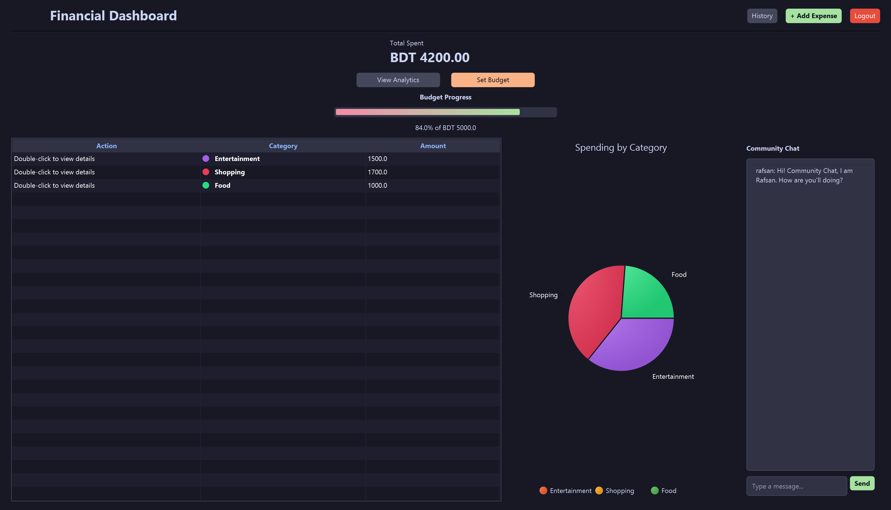
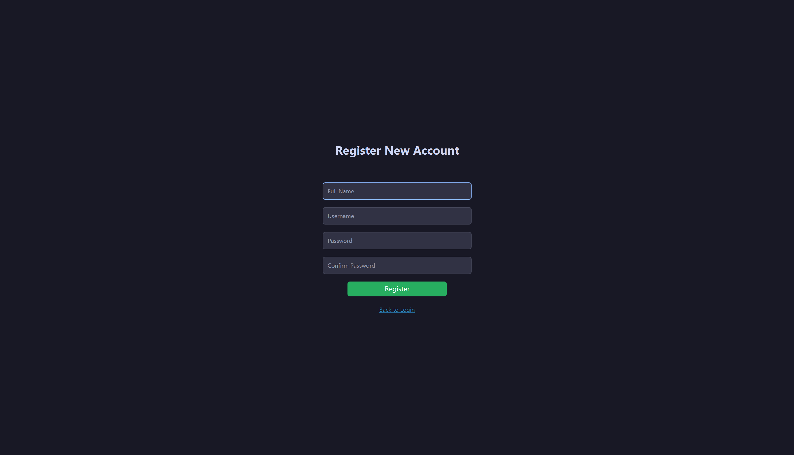

# 💰 AssetFlow: Real-Time Financial Management Suite

  
  
  
  

---

## 🌟 Overview
**AssetFlow** is a sophisticated desktop financial ecosystem designed for the modern user. Beyond simple expense tracking, it bridges the gap between personal finance and community engagement through a custom **real-time chat architecture**. 

Built with a focus on **concurrency**, **data persistence**, and **UX design**, this application serves as a comprehensive portfolio piece demonstrating full-stack desktop development capabilities.

---

## 🚀 Core Features

### 📊 Financial Intelligence
- **Dynamic Analytics:** Real-time **PieChart** visualizations categorized by spending habits (Food, Transport, Bills, etc.).
- **Smart Budgeting:** Interactive budget status bars that calculate remaining liquidity using live data updates.
- **Data Persistence:** Reliable transaction logging using CSV-based storage for lightweight, portable data management.

### 💬 Community Engine
- **Multi-Client Networking:** A robust **TCP/IP Socket Server** that handles simultaneous connections using multithreaded `ClientHandlers`.
- **Broadcast Protocol:** Instant message synchronization across different laptops on the same network.
- **Asynchronous UI:** Background network threads utilizing `Platform.runLater()` to ensure a zero-lag user experience.

---

## 🛠️ Technical Deep Dive

| Layer | Technology | Key Implementation |
| :--- | :--- | :--- |
| **View** | JavaFX / FXML | Custom CSS, Constrained Resize Policies |
| **Logic** | Java 21 | MVC Pattern, Filtered & Sorted Lists |
| **Network** | Java Sockets | Multi-threaded Server, TCP Broadcast |
| **Storage** | Flat-file CSV | Buffered I/O for efficient R/W operations |

---

## 📸 System Preview

  
  

---

## 📥 Getting Started

### 1. Prerequisites
- **Java Development Kit (JDK) 21+**
- **JavaFX SDK 21.0.6**

### 2. Network Setup (For Multi-Laptop Connectivity)
1. Run `ChatServer.java` on the host machine.
2. Find the host's IPv4 address via `ipconfig`.
3. In `ChatService.java`, update the `host` parameter with the Server IP.
4. Disable Firewall for port `12345`.

---

## ✍️ Author

**Rafsan Rahman** *Computer Science & Engineering Student at BUET* 
**Azraf Daiyan Rahik** *Computer Science & Engineering Student at BUET*

  
  

- 🎯 **Current Focus:** Full-stack Web Development & Competitive Programming
- 🛠️ **Skills:** C++, Java, Python, JavaScript, Git, Socket Programming
- 💬 **Ask me about:** JavaFX UI Design or TCP/IP Networking Logic

---

<i>This project was developed to simulate micro-economies and enhance financial literacy through technology.</i>
